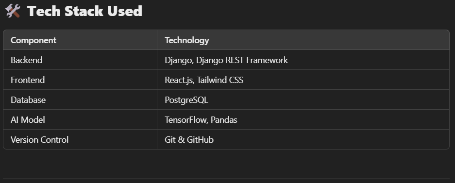
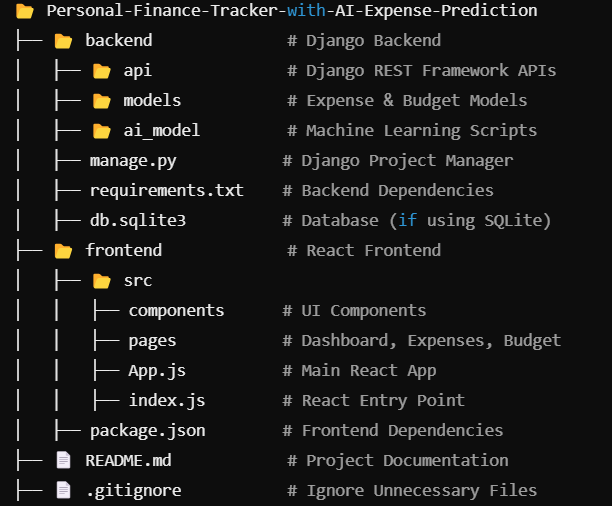

Personal Finance Tracker with AI Expense Prediction
🚀 Track, Predict, and Save Effortlessly!
This project is an intelligent Personal Finance Tracker that helps you monitor expenses, set budgets, and predict future spending using AI. Built with Django, React.js, TensorFlow, and PostgreSQL, it simplifies financial management like never before!

🌟 Why This Project?
Managing finances can be overwhelming.
💸 Do you struggle with tracking your expenses?
📊 Wish you had AI-powered predictions for better budgeting?
📉 Want an intuitive dashboard to visualize spending trends?

This project is your all-in-one solution! It brings:
✔ Real-time Expense Tracking – Log & categorize expenses easily
✔ AI-Powered Predictions – Forecast future expenses using past trends
✔ Smart Budgeting – Set financial goals & track savings
✔ Visual Dashboards – Interactive charts for financial insights

📌 Project Workflow
User Registration & Authentication

Sign up & log in securely
Encrypted user data storage
Expense Management

Add, edit, or delete transactions
Categorize expenses (Food, Transport, Rent, etc.)
AI Predictions

Machine learning model predicts future expenses
Uses TensorFlow for trend analysis
Budget Planning & Savings Tracker

Set monthly budgets for each category
Track savings goals & progress
Dashboard Visualization

View insights with interactive graphs
Monitor income vs expenses
  

*********************************************************************************************************************************************

🏗 Setup & Installation
1️⃣ Clone the Repository
  
  git clone https://github.com/48Naveenkumar/Personal-Finance-Tracker-with-AI-Expense-Prediction.git
  cd Personal-Finance-Tracker-with-AI-Expense-Prediction

*********************************************************************************************************************************************

2️⃣ Backend Setup (Django API)

  cd backend
  python -m venv env
  source env/bin/activate  # On Windows: env\Scripts\activate
  pip install -r requirements.txt
  python manage.py migrate
  python manage.py runserver

*********************************************************************************************************************************************

3️⃣ Frontend Setup (React.js UI)

  cd frontend
  npm install
  npm start

*********************************************************************************************************************************************

4️⃣ AI Model Setup (Expense Prediction Model)

  cd backend/ai_model
  python train_model.py  # Train the AI model

*********************************************************************************************************************************************

🚀 Commands for Running the Project
🔥 Start the Backend

 cd backend
 python manage.py runserver

*********************************************************************************************************************************************

💻 Start the Frontend
cd frontend
npm start

*********************************************************************************************************************************************

🤖 Train AI Model

cd backend/ai_model
python train_model.py

*********************************************************************************************************************************************

🤝 Contributing
I welcome contributions! If you'd like to improve this project:

Fork the repository
Create a feature branch (git checkout -b feature-branch)
Commit your changes (git commit -m "Your message")
Push to the branch (git push origin feature-branch)
Open a Pull Request 🎉
